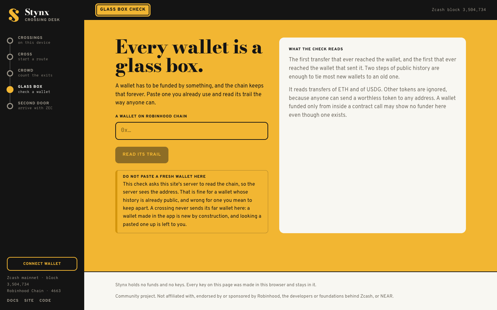
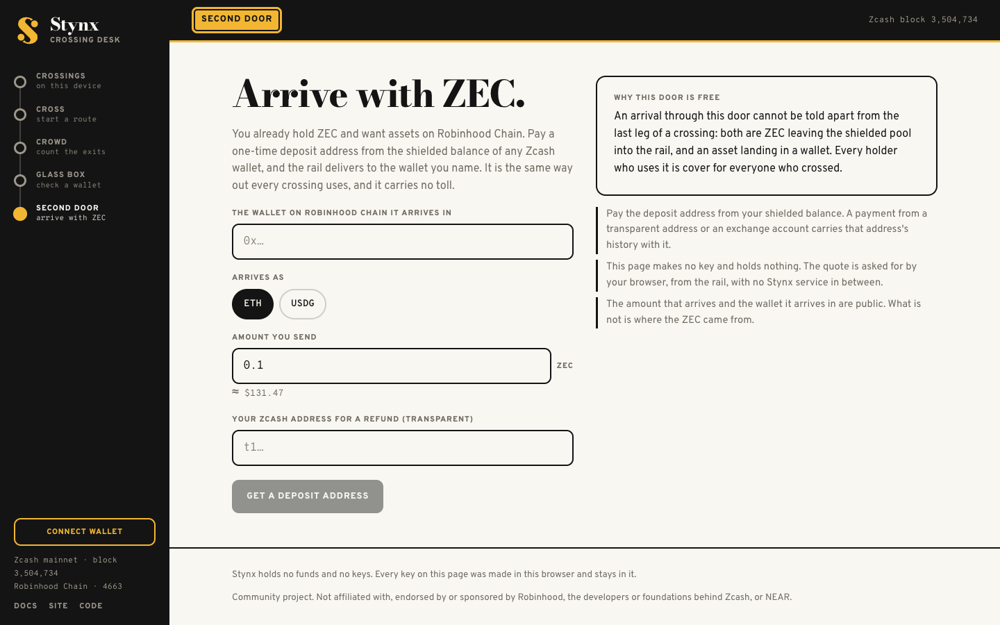
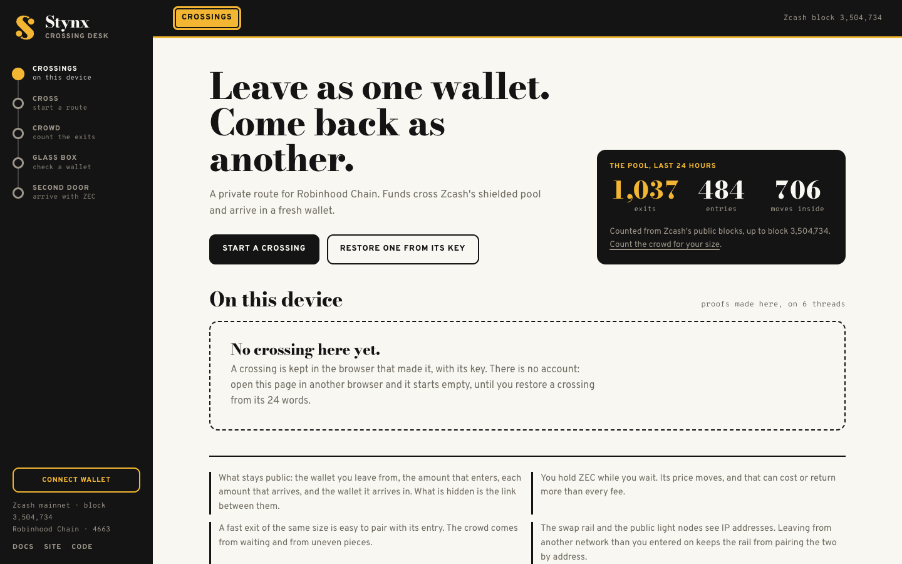
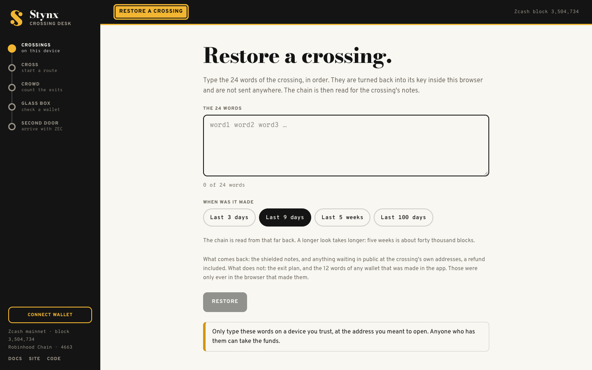
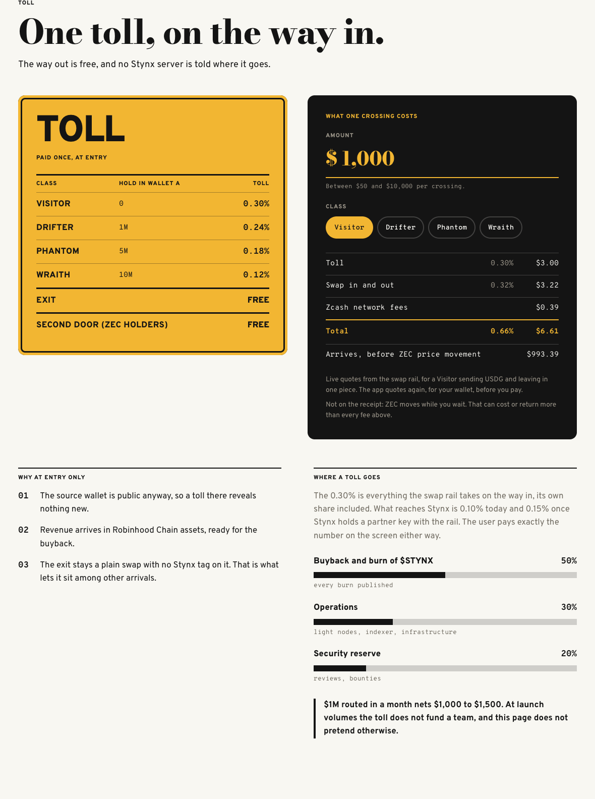
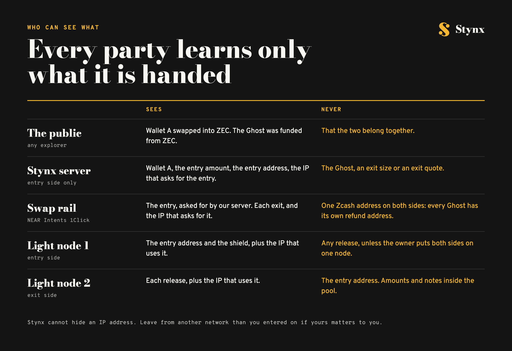

<div align="center">


<br>

# Stynx

**A private route for Robinhood Chain.**

Funds cross Zcash's shielded pool and arrive in a fresh wallet.<br>
The proof is made in your browser, and nobody holds your money.

<br>

[](https://app.stynx.cash)
[](#stynx-token)
[](https://stynx.cash/docs)
[](#how-a-crossing-works)
[](#privacy-by-design)
[](#privacy-by-design)

[**Site**](https://stynx.cash) · [**App**](https://app.stynx.cash) · [**Docs**](https://stynx.cash/docs) · [**X @stynxcash**](https://x.com/stynxcash) · [**GitHub**](https://github.com/stynxcash)

</div>

---

## About

Every wallet on a public chain is a glass box. A fresh wallet has to be funded by something, and every explorer prints that something on its first line: your old wallet, for good. Wallet watchers and copy-traders read that line in minutes. An exchange hop trades it for an account record, a bridge carries it to another chain, and a new privacy pool opens with a crowd of one.

Stynx cuts that line. Wallet A sends USDG or ETH on Robinhood Chain, the swap rail turns it into ZEC, your browser shields it into Zcash's pool with a zero-knowledge proof, and after a wait it leaves in uneven pieces to a wallet that has never been seen before: **the Ghost**.

- **Borrowed depth.** Privacy is a crowd, and a crowd takes years to gather. Stynx builds no pool. It routes through the one Zcash has been filling for years: about 4.9M ZEC shielded, 29% of supply, and 1,100 exits on a single day.
- **Nothing to hold.** No pool contract, no router contract, no relayer, no custody. The server keeps no user tables and has no exit endpoint at all.
- **Honest numbers.** The Crowd Meter counts look-alike exits before you pay and says which layer it does not count yet. What stays visible is listed above the fold, not buried in the docs.

<div align="center">

</div>

<table>
<tr>
<td width="72%"></td>
<td width="28%"></td>
</tr>
<tr>
<td align="center"><sub><a href="https://stynx.cash">stynx.cash</a>, live since 2 October 2026</sub></td>
<td align="center"><sub>The same page on a phone</sub></td>
</tr>
</table>

## Features

### 🛣️ The Crossing

Pick an amount, an asset and a wait. The planner shows the full cost and the crowd for your size before anything moves, and nothing is sent until the crossing's key is written down. The toll is taken once, on the way in. The way out is free.

<table>
<tr>
<td width="70%"></td>
<td width="30%"></td>
</tr>
</table>

### 📊 Crowd Meter

Type the size of one exit piece and see how many exits of a similar size left Zcash's shielded pool in the last day, three days or week. The count is made in your browser from public blocks: the size you type is sent to nobody. A grade of **Thin**, **Fair** or **Deep** sits next to it, and a Thin grade never blocks you. It tells you the fix: wait longer or cut smaller pieces.


| Piece size | 24 hours | 3 days | 7 days |
|---|---:|---:|---:|
| $100 | 28 | 74 | 178 |
| $1,000 | 23 | 79 | 183 |
| $5,000 | 10 | 34 | 117 |
| $10,000 | 26 | 67 | 135 |

<sub>Exits within 10% of the piece size, measured from public Zcash blocks on 2 October 2026. Layer 2, wallets on Robinhood Chain funded from ZEC, is not counted yet and the meter says so.</sub>

### 🔍 Glass Box check

Paste a wallet you already use and read its funding trail the way anyone can: the first transfer that ever reached it, and the first that reached the wallet that sent it. Two steps of public history are enough to tie most new wallets to an old one. The page warns you never to paste a wallet you mean to keep apart.



### 👻 The Ghost and the exit planner

The far side of a crossing is a wallet the app makes for you, new by construction, with 12 words of its own. The exit leaves in two uneven pieces (three above $4,000), spaced 40 minutes to 3 hours apart, and no piece may sit within 3% of what went in. Part of it can stay shielded for a later Ghost, so no single wallet ever receives the whole amount.


### 🚪 Second door

Already hold ZEC? Pay a one-time deposit address from your shielded balance and ETH or USDG arrives in the Robinhood Chain wallet you name. This door is free, because an arrival through it looks exactly like the last leg of a crossing: every holder who uses it is cover for everyone who crossed.



### 🔑 Your key stays on your device

Every crossing has its own random key, shown once as 24 words. Three of them are typed back before anything is paid. There is no account and no signature to phish: lose the browser, type the 24 words on Restore, and the wallet core reads the chain until every note is found again. Stynx never receives a key, a seed, or anything that could derive one.

<table>
<tr>
<td width="50%"></td>
<td width="50%"></td>
</tr>
<tr>
<td align="center"><sub>Crossings live in the browser that made them</sub></td>
<td align="center"><sub>Restore one anywhere from its 24 words</sub></td>
</tr>
</table>

### 🎫 One toll, printed before you pay

0.30% of the entry, the rail's own fee included, shown above the button with every other cost. Exits are free and carry no Stynx tag, which is what lets them sit among other arrivals.



## At a glance

| | |
|---|---|
| **Route** | Robinhood Chain → Zcash shielded pool → Robinhood Chain |
| **Assets** | In with USDG or ETH, out to ETH or USDG |
| **Per crossing** | $50 minimum, $10,000 maximum |
| **Wait** | 6 h, 24 h, 72 h (default) or 7 days |
| **Exit** | 2 uneven pieces, 3 above $4,000, 40 minutes to 3 hours apart |
| **Toll** | 0.30% once, on the way in. Exit and second door are free |
| **Timing** | About 2.5 minutes in, about 7.5 minutes per exit piece |
| **Keys** | A random key per crossing, written as 24 words |
| **Proofs** | Made in your browser, on 6 threads |
| **Status** | Site and app live on mainnet since 2 October 2026. Token not issued |

## How a crossing works


```
 PUBLIC SIDE                      ZCASH SHIELDED POOL                FAR SIDE
┌───────────────────────┐        ┌──────────────────────────┐       ┌───────────────────────┐
│ wallet A              │        │                          │       │ the Ghost             │
│ USDG / ETH            │──swap─▶│ ZEC on a slot-0 address  │       │ fresh, made by the app│
│ toll 0.30%, once      │  ~2.5m │          │               │       │ ETH for fees in       │
└───────────────────────┘        │          ▼ proof in the  │       │ the first piece       │
                                 │   shielded note  browser │       └───────────▲───────────┘
                                 │          │               │                   │
                                 │   wait 6 h to 7 days     │──piece 1──────────┤ ~7.5 min
                                 │          │               │──piece 2 +40m..3h─┤ each
                                 │   remainder may stay ────┼──▶ a later Ghost  │
                                 └──────────────────────────┘
      the public trail stops here ─────────▲
```

## Privacy by design


Keys, proofs, the Ghost, the exit pieces and their timing are decided in the browser and nowhere else. The server prices the entry, checks the wallet named on a quote against the public sanctions list, and serves public chain data. Two public Zcash light nodes from different operators split the work, so neither is ever told about both sides.



## Roadmap


| Phase | Window | Scope | Status |
|---|---|---|---|
| 0 · Proof | days 1 to 5 | Wallet core proved on Zcash testnet, real costs and timings measured | Done |
| 1 · MVP | weeks 1 to 5 | Crowd Meter, Glass Box, docs, the full crossing on mainnet | Live, first mainnet crossing next |
| 2 · Token | after the first crossing | $STYNX fair launch, toll classes, 72 hours of full creator-fee burns | Next |
| 3 · Growth | months 2 to 3 | Several Ghosts per exit, timed exits, one-click Papers, exposure watch | Planned |
| 4 · Upgrade | months 3 to 6 | Exit through a second chain, fee split in an ownerless contract, independent review | Planned |
| 5 · Ecosystem | months 6 to 12 | Embedded crossing for wallets and terminals, community light nodes | Planned |

## $STYNX token


| | |
|---|---|
| **Ticker** | $STYNX |
| **Supply** | 1,000,000,000, fixed |
| **Team allocation** | 0. 100% to the bonding curve |
| **Launch** | Robinhood Chain launchpad, after the first mainnet crossing. DEX graduation, LP locked |
| **Creator fees** | 100% buyback and burn for 72 hours, then 50% burn and 50% development |
| **Net toll** | 50% buyback and burn, 30% operations, 20% security reserve |
| **Emissions / staking** | None / none |


Holding lowers the toll and opens deeper Glass Box traces. It never buys privacy: waits, split rules, limits and the crowd are the same for every wallet.


## Scam warning

> [!WARNING]
> **$STYNX is not issued yet.** Any token using the name today is not ours.
> The contract address will appear on [stynx.cash](https://stynx.cash) and [@stynxcash](https://x.com/stynxcash) only.
> There is no presale, no whitelist and no allocation to buy. Anyone who DMs you about one is a scammer.
> Stynx never asks for your 24 words.

## Links

| | |
|---|---|
| Landing page | https://stynx.cash |
| The app | https://app.stynx.cash |
| Docs: what is hidden, what is not | https://stynx.cash/docs |
| X | https://x.com/stynxcash |
| GitHub | https://github.com/stynxcash |

---

<div align="center">


<sub>Stynx is experimental software. It separates two wallets on public chains; it does not make activity invisible, and the docs list what stays visible. Nothing here is financial, investment, legal or tax advice. You are responsible for following the laws that apply to you; wallets on the public sanctions list are refused. While a crossing waits you hold ZEC, whose price can fall. Swaps depend on third-party liquidity and can fail or be refunded. $STYNX is a utility token for access within the product; it confers no ownership, profit share or claim on any entity or asset. Stynx is a community project, not affiliated with, endorsed by or sponsored by Robinhood, the developers or foundations behind Zcash, or NEAR.</sub>
</div>
