<div align="center">

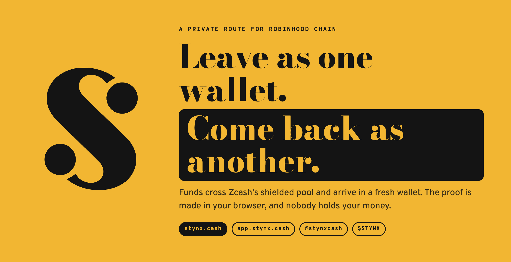

<br>

# Stynx

**A private route for Robinhood Chain.**

Funds cross Zcash's shielded pool and arrive in a fresh wallet.<br>
The proof is made in your browser, and nobody holds your money.

<br>

[](https://app.stynx.cash)
[](#token-at-a-glance)
[](https://stynx.cash/docs)
[](#how-a-crossing-works)
[](documents/stynx-kernel)
[](documents/stynx-console)

[**Site**](https://stynx.cash) · [**App**](https://app.stynx.cash) · [**Docs**](https://stynx.cash/docs) · [**X @stynxcash**](https://x.com/stynxcash) · [**GitHub**](https://github.com/stynxcash)

</div>

---

## What is Stynx

Every wallet on a public chain is a glass box. A fresh wallet has to be funded by something, and the explorer prints that something on its first line: your old wallet, for good. Stynx cuts that line. Wallet A sends USDG or ETH on Robinhood Chain, the swap rail turns it into ZEC, your browser shields it into Zcash's pool with a zero-knowledge proof, and after a wait it leaves in uneven pieces to a wallet that has never been seen before: the Ghost.

- **Borrowed depth.** Stynx builds no pool. It routes through the one Zcash has been filling for years: about 4.9M ZEC shielded and 1,100 exits on a single day.
- **Nothing to hold.** No pool contract, no router contract, no relayer, no custody. The server keeps no user tables and has no exit endpoint at all.
- **Honest numbers.** The Crowd Meter counts look-alike exits before you pay, says which layer it does not count yet, and the landing page lists what stays visible above the fold.

<div align="center">
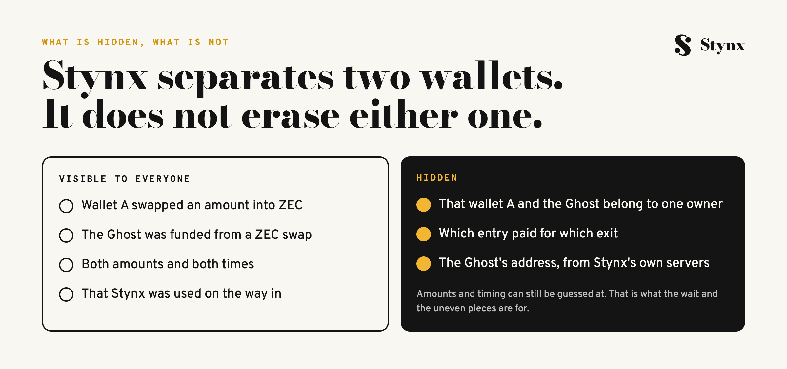
</div>

<table>
<tr>
<td width="72%">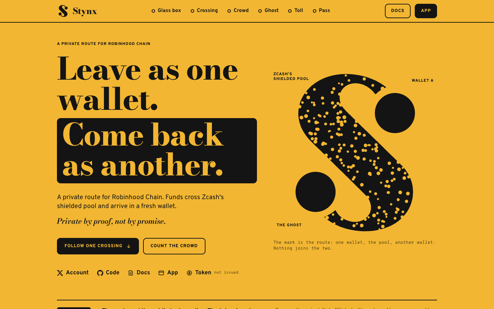</td>
<td width="28%">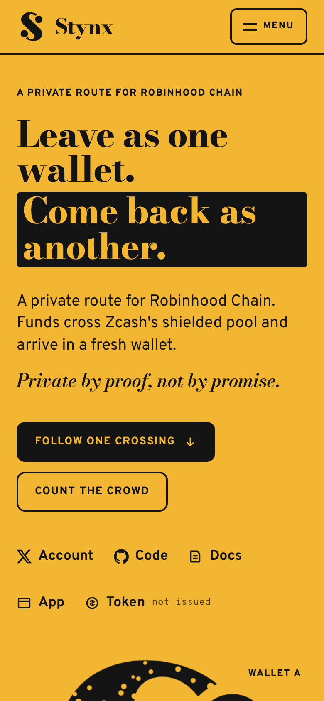</td>
</tr>
<tr>
<td align="center"><sub><a href="https://stynx.cash">stynx.cash</a>, live since 2 October 2026</sub></td>
<td align="center"><sub>The same page on a phone</sub></td>
</tr>
</table>

## Highlights

| | |
|---|---|
| **Route** | Robinhood Chain → Zcash shielded pool → Robinhood Chain |
| **Entry assets** | USDG, ETH (exits to ETH or USDG) |
| **Per crossing** | $50 minimum, $10,000 maximum |
| **Wait** | 6 h, 24 h, 72 h (default) or 7 days |
| **Exit** | 2 uneven pieces, 3 above $4,000, spaced 40 minutes to 3 hours apart |
| **Toll** | 0.30% once, on the way in, rail fee included. The way out is free |
| **Keys** | A random key shown as 24 words, three typed back before anything is paid |
| **Proving** | In the browser: Rust compiled to WebAssembly, 6 threads |
| **Server** | Stateless. Sees the entry, never the Ghost, an exit size or an exit quote |
| **Status** | Site and app live on mainnet since 2 October 2026. Token not issued |

## How a crossing works

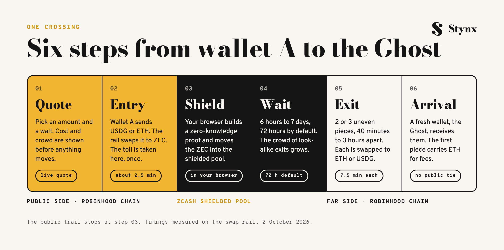

```
 PUBLIC SIDE                      ZCASH SHIELDED POOL                FAR SIDE
┌───────────────────────┐        ┌──────────────────────────┐       ┌───────────────────────┐
│ wallet A              │        │                          │       │ the Ghost             │
│ USDG / ETH            │──swap─▶│ ZEC on a slot-0 address  │       │ fresh, made by the app│
│ toll 0.30%, once      │  ~2.5m │          │               │       │ ETH for fees in       │
└───────────────────────┘        │          ▼ proof in the  │       │ the first piece       │
                                 │   shielded note  browser │       └───────────▲───────────┘
                                 │          │               │                   │
                                 │   wait 6 h to 7 days     │──piece 1──────────┤ ~7.5 min
                                 │          │               │──piece 2 +40m..3h─┤ each
                                 │   remainder may stay ────┼──▶ a later Ghost  │
                                 └──────────────────────────┘
      the public trail stops here ─────────▲
```

<table>
<tr>
<td width="68%">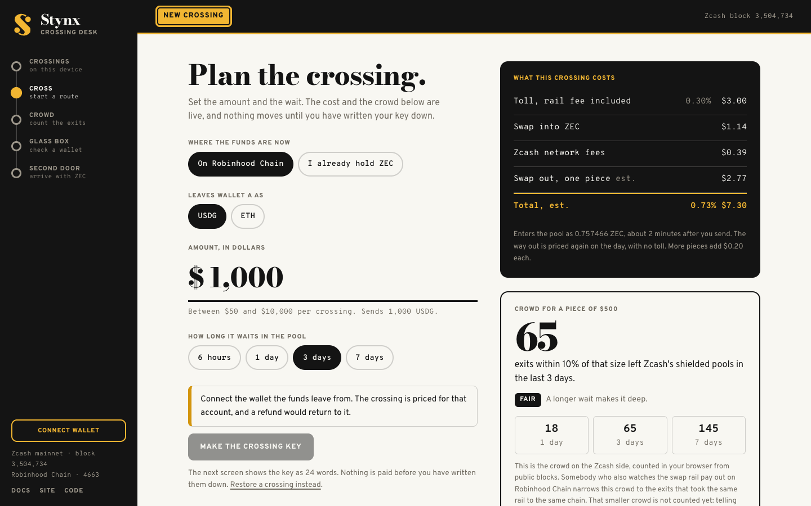</td>
<td width="32%">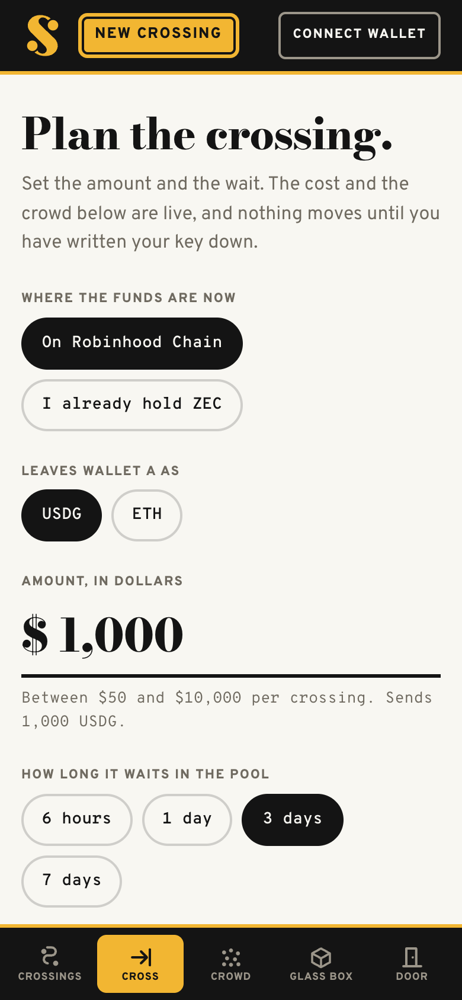</td>
</tr>
<tr>
<td align="center"><sub>Plan the crossing: live cost and crowd, nothing moves until the key is written down</sub></td>
<td align="center"><sub>The same planner on a phone</sub></td>
</tr>
</table>

## The rules the app enforces

A shielded pool is only as private as the habits around it. Peer-reviewed analysis of Zcash (Kappos et al., USENIX Security 2018) showed that the same amount going in and out after a short stay shrinks the crowd. Stynx turns the opposite habits into defaults.

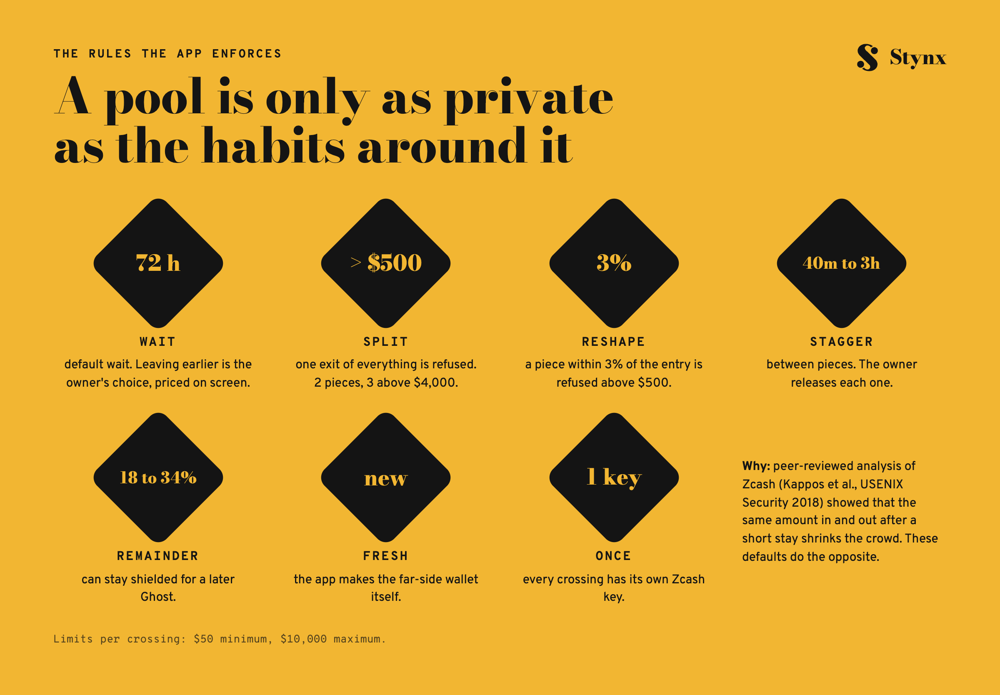

## Count the crowd before you pay

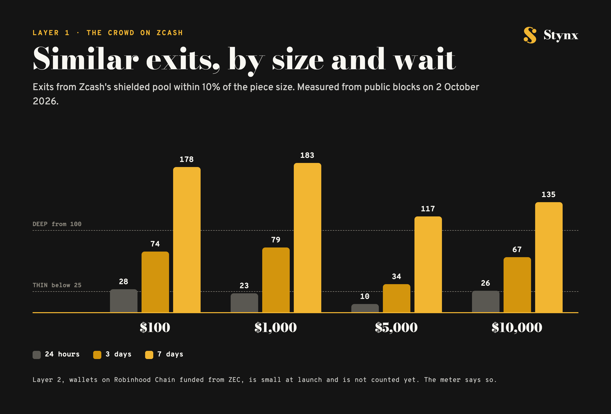

| Piece size | 24 hours | 3 days | 7 days |
|---|---:|---:|---:|
| $100 | 28 | 74 | 178 |
| $1,000 | 23 | 79 | 183 |
| $5,000 | 10 | 34 | 117 |
| $10,000 | 26 | 67 | 135 |

<sub>Exits within 10% of the piece size, measured from public Zcash blocks on 2 October 2026. Grade: Thin under 25, Fair 25 to 99, Deep from 100. Layer 2, wallets on Robinhood Chain funded from ZEC, is not counted yet and the meter says so.</sub>

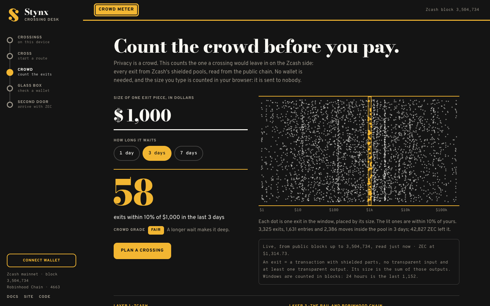

## Architecture

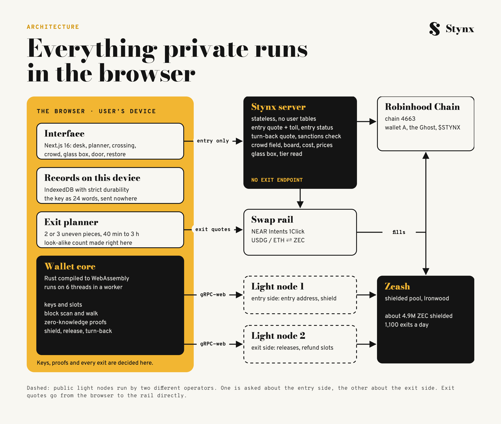

Keys, proofs, the Ghost, the exit pieces and their timing are decided in the browser. The server prices the entry, checks the wallet named on a quote against the public sanctions list, and serves public chain data. Two public Zcash light nodes from different operators split the work: one is asked about the entry side, the other gets the releases.

## Repository layout

| Repository | What it holds |
|---|---|
| [`stynx-kernel`](documents/stynx-kernel) | The wallet core (Rust → WebAssembly) and the route rules, with a C4 system design and a tested `route-rules` crate |
| [`stynx-treatise`](documents/stynx-treatise) | The treatise (whitepaper) and the STRIDE threat model: what is hidden, what is not, and how to check |
| [`stynx-conduit`](documents/stynx-conduit) | The public API of app.stynx.cash, its full reference and a typed TypeScript client |
| [`stynx-console`](documents/stynx-console) | The crossing desk and the landing page: a screen-by-screen tour, the design language and a source skeleton |
| [`stynx-observatory`](documents/stynx-observatory) | How the crowd on Zcash is measured, the 2 October snapshot and a script that checks the meter's numbers |

Marketing collateral in this workspace:

| Folder | Contents |
|---|---|
| [`Caption/`](Caption) | `CAPTION.md` (29 long-form captions) and `CAPTION-SHORT.md` (30 operator-log posts) |
| [`Article/`](Article) | `X-Article.md` (three long-form X Articles) |

## Tech stack

| Layer | Technology |
|---|---|
| Wallet core | Rust, `wasm-bindgen`, `wasm-bindgen-rayon` (threaded proving), built from the open-source zenvelope crate (MIT) |
| Zcash access | Public lightwalletd nodes over gRPC-web, compact blocks only |
| App and landing page | Next.js 16.3.8, React 19.3, Tailwind 4, TypeScript |
| Local records | IndexedDB with strict durability, Web Locks |
| Wallet connection | EIP-1193 wallets on Robinhood Chain (chain 4663) |
| Swap rail | NEAR Intents 1Click |
| Hosting | Non-root containers behind a TLS reverse proxy and an edge network |

## Roadmap

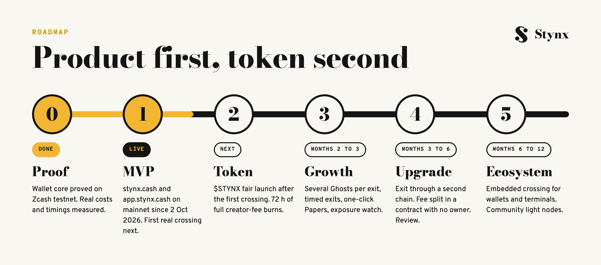

| Phase | Window | Scope | Status |
|---|---|---|---|
| 0 · Proof | days 1 to 5 | Wallet core proved on Zcash testnet, real costs and timings measured | Done |
| 1 · MVP | weeks 1 to 5 | Crowd Meter, Glass Box, docs, the full crossing on mainnet | Live, first mainnet crossing next |
| 2 · Token | after the first crossing | $STYNX fair launch, toll classes, 72 hours of full creator-fee burns | Next |
| 3 · Growth | months 2 to 3 | Several Ghosts per exit, timed exits, one-click Papers, exposure watch | Planned |
| 4 · Upgrade | months 3 to 6 | Exit through a second chain, fee split in an ownerless contract, independent review | Planned |
| 5 · Ecosystem | months 6 to 12 | Embedded crossing for wallets and terminals, community light nodes | Planned |

## Token at a glance

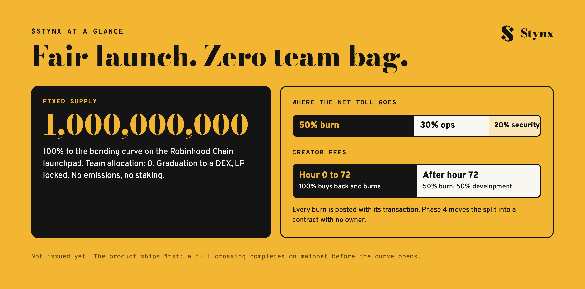

| | |
|---|---|
| **Ticker** | $STYNX |
| **Supply** | 1,000,000,000, fixed |
| **Team allocation** | 0. 100% to the bonding curve |
| **Launch** | Robinhood Chain launchpad, after the first mainnet crossing. DEX graduation, LP locked |
| **Creator fees** | 100% buyback and burn for 72 hours, then 50% burn and 50% development |
| **Net toll** | 50% buyback and burn, 30% operations, 20% security reserve |
| **Emissions / staking** | None / none |

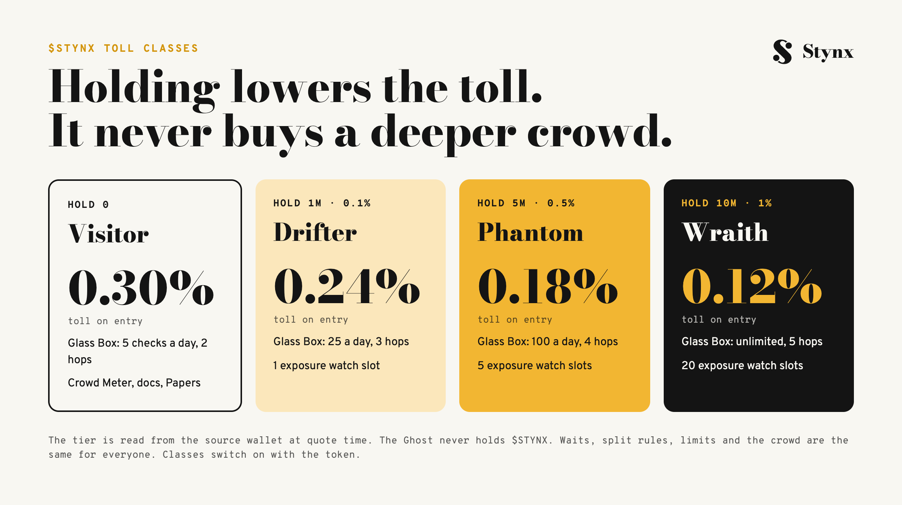

The token lowers the toll and opens deeper Glass Box traces. It never buys privacy: waits, split rules, limits and the crowd are the same for every wallet.

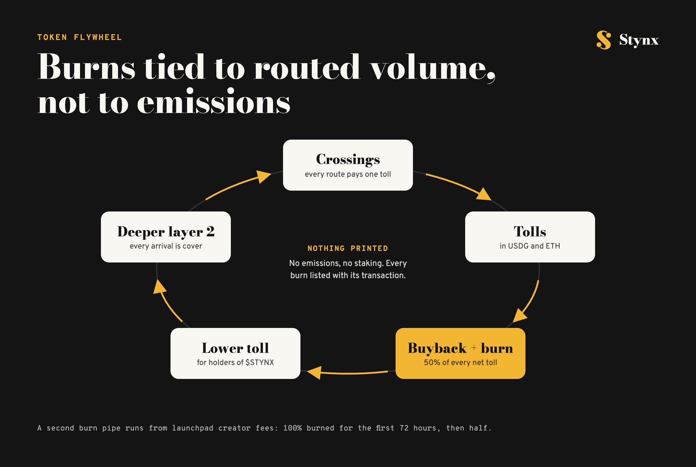

## Scam warning

> [!WARNING]
> **$STYNX is not issued yet.** Any token using the name today is not ours.
> The contract address will appear on [stynx.cash](https://stynx.cash) and [@stynxcash](https://x.com/stynxcash) only.
> There is no presale, no whitelist and no allocation to buy. Anyone who DMs you about one is a scammer.
> Stynx never asks for your 24 words. Anything a stranger sends you is a scam.

## Quick start

The parts of this workspace that run on their own:

```bash
# route rules: limits, planner checks, crowd grade, toll classes
cd documents/stynx-kernel/crates/route-rules && cargo test

# check the live Crowd Meter's numbers yourself
node documents/stynx-observatory/scripts/crowd-check.mjs --usd 1000 --hours 72

# typed client for the public API
cd documents/stynx-conduit/packages/client && npm install && npm test
```

Or skip the terminal: open [app.stynx.cash/crowd](https://app.stynx.cash/crowd), type an amount and count the crowd. No wallet needed.

## Reference links

| Resource | Link |
|---|---|
| Landing page | https://stynx.cash |
| The app | https://app.stynx.cash |
| Docs: what is hidden, what is not | https://stynx.cash/docs |
| X | https://x.com/stynxcash |
| GitHub | https://github.com/stynxcash |
| Zcash shielded pools | https://z.cash |
| NEAR Intents | https://near.org/intents |
| Kappos et al., USENIX Security 2018 (Zcash usage patterns) | https://www.usenix.org/conference/usenixsecurity18/presentation/kappos |

---

<div align="center">


<sub>Stynx is experimental software. It separates two wallets on public chains; it does not make activity invisible, and the docs list what stays visible. Nothing here is financial, investment, legal or tax advice. You are responsible for following the laws that apply to you; wallets on the public sanctions list are refused. While a crossing waits you hold ZEC, whose price can fall. Swaps depend on third-party liquidity and can fail or be refunded. $STYNX is a utility token for access within the product; it confers no ownership, profit share or claim on any entity or asset. Stynx is a community project, not affiliated with, endorsed by or sponsored by Robinhood, the developers or foundations behind Zcash, or NEAR.</sub>
</div>
